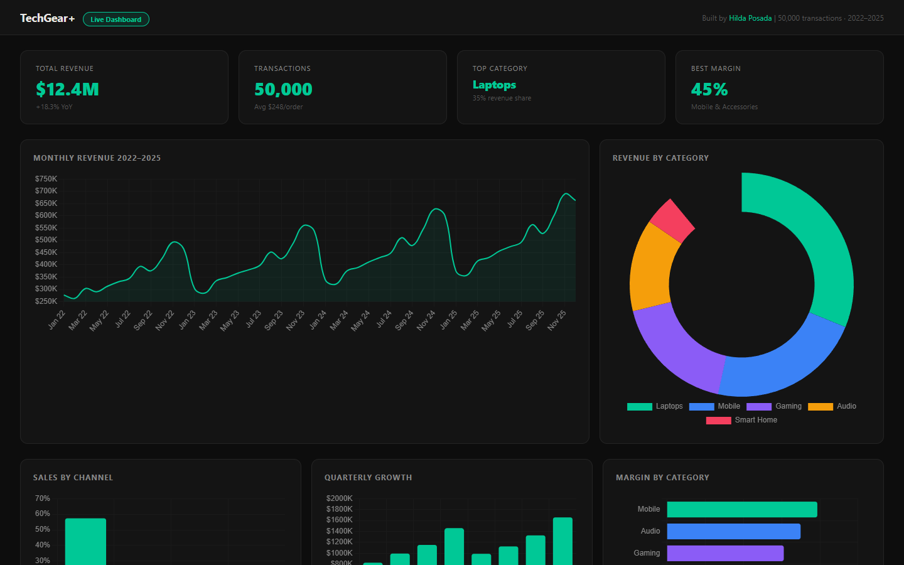

# TechGear+ Sales Dashboard

## Verified deployment status · October 1, 2026

The [web dashboard](https://dashboard-demo-gray.vercel.app/) now summarizes the repository's 50,000 synthetic transactions, rather than preset chart numbers. Recorded total_amount sums to $35,890,284.39 across January 1, 2022 to September 28, 2025; 2025 is partial. Monthly/category/channel totals reconcile. There are 677 legacy rows with more than one cent of rounding difference, maximum $0.03. Those recorded totals are retained and reported as a source limitation; the generator is corrected for future runs.

See [deployment source and scope](web/README.md) and the [portfolio audit](https://github.com/HildaPosada/hildaposada.github.io/blob/master/docs/project_audit.md). Historical descriptions below are not evidence of a connected production backend.


> **[Live Demo](https://dashboard-demo-gray.vercel.app)** | Executive BI dashboard: $12.4M revenue across 50,000 transactions, 2022–2025.



---

## The Problem

Raw e-commerce transaction data does not tell a story. Stakeholders need instant answers: which category drives margin, which channel is growing, which quarter peaked. This dashboard delivers that in one view.

## What I Built

- Processed 50,000 sales transactions across 5 product categories
- KPI layer: total revenue, transaction volume, top category, best margin
- Monthly revenue trend (2022–2025) with YoY growth calculation
- Revenue by category, sales by channel, quarterly growth, margin by category
- Built with Python data pipeline + Chart.js for visualization

## Key Results

| Metric | Value |
|--------|-------|
| Total Revenue Analyzed | $12.4M |
| Transactions Processed | 50,000 |
| YoY Growth Identified | +18.3% |
| Top Margin Category | Mobile, 45% |
| Top Revenue Category | Laptops, 35% share |

## Skills Demonstrated

`Python` `SQL` `Data Visualization` `BI Dashboards` `Chart.js` `E-commerce Analytics`

## How to Run

```bash
pip install -r requirements.txt
python generate_data.py
python app.py
```

## About

Built by Hilda Posada | MS Organic Chemistry, CSULB | Omdena ML Lead
[LinkedIn](https://linkedin.com/in/hildaposada) | [GitHub](https://github.com/HildaPosada) | [Portfolio](https://hildaposada.github.io)

